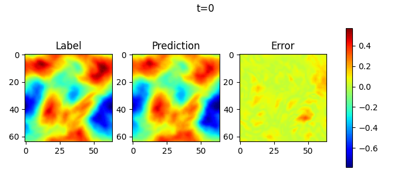

## Hard Constraining Navier-Stokes Flow Prediction

Hard Constraining global vorticity in N-S flow via a modular correction head. This is a demo experiment for my FYP: "Towards physics-preserving transformer architectures".

<!-- TODO: replace this with HC version (also showing mean deviation) -->



> example results of non-hard constrained model (to be improved)


Used [this dataset](https://github.com/mindspore-ai/mindscience/tree/master/MindFlow/applications/data_driven/navier_stokes/fno2d) to predict [vorticity](https://en.wikipedia.org/wiki/Vorticity) in N-S flow. Given a Vorticity field $\omega (x,y)$. The velocity field $\mathbf{u}=(u,v)$ obtained from vorticity is divergence-free by definition. 

The conversion is done via a stream function 

$$\omega =-\Delta \psi \quad \text{Poisson Equation}$$

$$u=\frac{\partial \psi}{\partial y}, \quad v=-\frac{\partial \psi}{\partial x}$$

Additionally, we want to enforce global vorticity (or the mean of the prediction).
Because of the periodic domain, vorticity should stay constant
$$\int w(x,y)dxdy=c \quad (c=0 \text{ in our case})$$

a vanilla model can learn accurate flow predictions, but the predicted global vorticity does not have to be constant.


We implement a correction head that goes in parallel with the prediction head of the model, and predicts an offset map that corrects the output of the original prediction dynamically. 
```python
# CH is the correction head
# PH is the prediction head
corr = CH() - CH().mean() + PH().mean()
output = PH() - corr

```
and therefore the output mean is hard constrained to global vorticity 0. 


Models takem from [here](https://github.com/thuml/Neural-Solver-Library/tree/main/models)
Dataset taken from [here](https://github.com/mindspore-ai/mindscience/tree/master/MindFlow/applications/data_driven/navier_stokes/fno2d)

### TODO:
- [X] Config launching in optuna
- [X] refactor [notebook](2d_flow_garlekin.ipynb) to make it public
- [ ] Make graph of CH architecture
- [ ] Make mean correction section modular
- [ ] Search hyperparameters for correction module
- [ ] Search with different backbone architectures
- [ ] Show visualization of correction module
