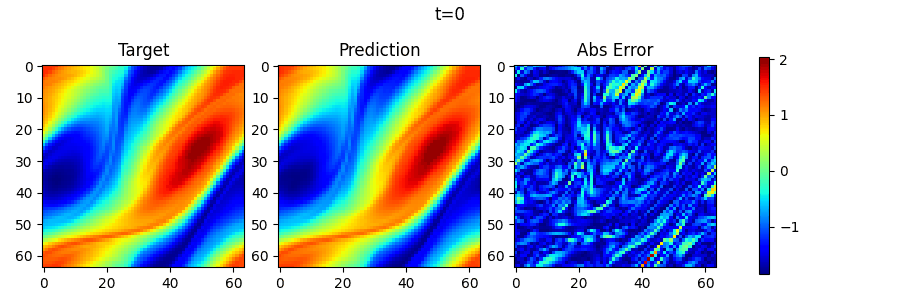
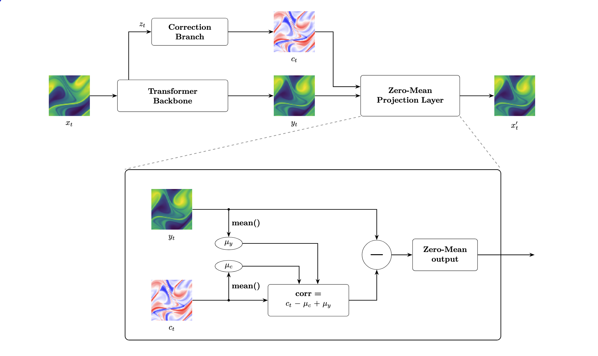

Hard Constraining global vorticity in Navier-Stokes flow via a modular correction head. This is a demo experiment for my FYP: "Towards physics-preserving transformer architectures"

By adding hard constraint module on Sci-ML Transformer backbones we ensure constant global vorticity on the Navier-Stokes `NavierStokes_V1e-5_N1200_T20.mat` dataset. This not only ensures that we respect the underlying physical properties of flow in a periodic domain, but significantly improves the performance of the model ([results here](#results)).

## Model Architecture



Given a Vorticity field $\omega (x,y)$. The velocity field $\mathbf{u}=(u,v)$ obtained from vorticity is divergence-free by definition. 

The conversion is done via a stream function 

$$\omega =-\Delta \psi \quad \text{Poisson Equation}$$

$$u=\frac{\partial \psi}{\partial y}, \quad v=-\frac{\partial \psi}{\partial x}$$

Additionally, we want to enforce global vorticity (or the mean of the prediction).
Because of the periodic domain, vorticity should stay constant
$$\int w(x,y)dxdy=c \quad (c=0 \text{ in our case})$$

a vanilla model can learn accurate flow predictions, but the predicted global vorticity does not have to be constant.


We implement a correction branch that goes in parallel with the prediction head (original backbone) of the model. It takes a latent representation of the input ($z_t$) and predicts an offset map ($c_t$) that corrects the output of the original prediction ($x_t$). 

```python
# CH is the correction head
# PH is the prediction head
corr = CH() - CH().mean() + PH().mean()
output = PH() - corr
```

and therefore the output mean is hard constrained to global vorticity 0. 

Importantly, this correction branch is fully modular, and attaches to the backbone via a forward hook. This means that you can easely change the underlying model by simply modifying the `backbone` field in the [config](config/README.md).

## Results

Original results are taken from [here](https://arxiv.org/abs/2402.02366). Further hard consrtained results to come, as compute is currently a bottleneck. 

| Model                         | Original Model Relative L2  | Hard Constrained Model Relative L2 | 
| ----------------------------- | --------------------------- | ---------------------------------- |
| Galerkin Transformer (Cao, 2021) | 0.1401                   | 0.103730                           |
| HT-NET (LIU ET AL., 2022)     | 0.1847                      | 
| OFORMER (LI ET AL., 2023C)    | 0.1705                      |
| GNOT (HAO ET AL., 2023)       | 0.1380                      |
| FACTFORMER (LI ET AL., 2023D) | 0.1214                      |
| ONO (XIAO ET AL., 2024)       | 0.1195                      |
| TRANSOLVER (WU ET AL 2024)    | 0.0900                      |

For now, I have provided the weights for the trained Galerkin Transformer model [here](checkpoints/NavierStokes_V1e-5_N1200_T20/galerkin_transformer_epoch482.pth). 


## Training and Evaluation

Train from scratch:

```bash
python main.py --config config/galerkin_latent_cfg.yaml
```

More info on the config file [here](/config/README.md). 

Resume a run with optimizer and scheduler state:
```bash
python main.py \
  --config config/galerkin_latent_cfg.yaml \
  --resume-checkpoint /path/to/checkpoint.pth
```

Initialize weights from a checkpoint but start a fresh run:

```bash
python main.py \
  --config config/galerkin_latent_cfg.yaml \
  --from-checkpoint /path/to/checkpoint.pth
```

More info on the checkpoint format [here](/checkpoints/README.md)

For evaluation 
```bash
python test.py \
  --config /path/to/config.yaml \
  --checkpoint /path/to/checkpoint.pth \
  --test-root /path/to/test_root \
  --video-path images/ns_rollout.gif
```


## Dataset

The supported dataset is the Navier-Stokes `.mat` file used by Neural-Solver-Library, found [here](https://drive.google.com/drive/folders/1UnbQh2WWc6knEHbLn-ZaXrKUZhp7pjt-) :

- `data/NavierStokes_V1e-5_N1200_T20/NavierStokes_V1e-5_N1200_T20.mat`

`path.root_dir` can point either to that `.mat` file directly or to the directory containing it.
